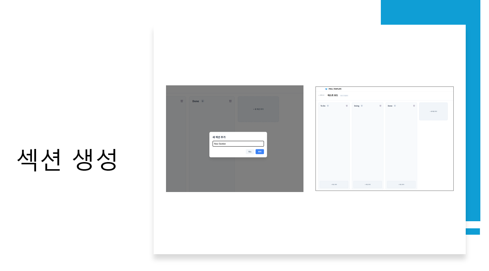
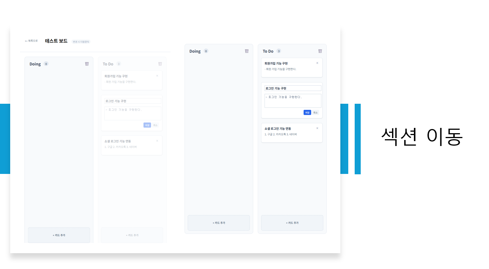
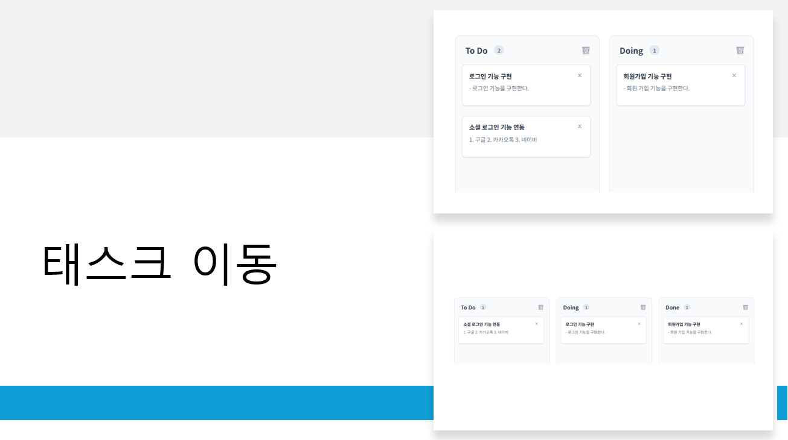

# 🖥 Kanban Frontend (FSD)

> **Project Status**: 🔄 Connected with Backend Repo

### 🔗 Repository Links
- **Frontend (Current)**: [https://github.com/Yithian01/kanban-frontend.git](https://github.com/Yithian01/kanban-frontend.git)
- **Backend (Partner)**: [https://github.com/Yithian01/kanban-backend.git](https://github.com/Yithian01/kanban-backend.git)

---

## 🛠 Project Overview
본 프로젝트는 **React 19**와 **FSD(Feature-Sliced Design)** 아키텍처를 적용한 칸반 보드 UI입니다. 
위 백엔드 API와 통신하여 실시간 데이터 연동 및 보안 인증을 수행합니다.

---
<br>

## 📸 주요 기능 (Features)

| 칸반 보드 생성 | 섹션(컬럼) 추가 |
| :---: | :---: |
|  |  |
| **칸반 생성 가이드** | **섹션 관리 UI** |

| 섹션 위치 이동 | 태스크 드래그 앤 드롭 |
| :---: | :---: |
|  |  |
| **섹션 순서 변경** | **자유로운 태스크 이동** |

---
<br>

# 📋 Git Commit Convention (Frontend)

React/TypeScript 기반의 프론트엔드 레포지토리 컨벤션입니다.

### 1. 커밋 메시지 구조
```text
<type>: <subject>

<body>
```

### 2. 커밋 타입 (Type)
| 타입 | 설명 |
| :--- | :--- |
| **feat** | 새로운 UI 컴포넌트 추가, 기능 구현 |
| **fix** | 버그 수정 (예: 렌더링 오류, 데이터 바인딩 오류) |
| **refactor** | 기능 변경 없는 코드 개선 (FSD 구조 변경, 가독성 향상) |
| **chore** | 패키지 설정(package.json), 주석 수정 등 코드 외적 변경 |
| **docs** | README, JSDoc 주석 수정 |

### 3. 규칙 및 제약 사항
1.  **제목과 본문 사이**: 반드시 **1줄의 공백**을 둡니다.
2.  **함수 주석 필수**: 모든 `function` 또는 `arrow function` 위에는 필수적으로 `/** ... */` 형태의 JSDoc 주석을 작성하여 기능을 설명합니다.

### 4. 커밋 예시
```text
feat: 칸반 보드 드래그 앤 드롭 기능 구현

- React-beautiful-dnd 라이브러리 도입
- 카드 위치 변경 시 API 호출 로직 추가
```
---
# 📋 Pull Request Template 가이드

PR 작성 시 아래 양식을 복사하여 내용을 채워주세요.

```markdown
## 🚀 작업 내용
- 핵심 작업 내용을 간결하게 작성 (예: 칸반 보드 이름 수정 API 연결)

## 💡 변경 사항
- **Frontend**: `EditableBoardName` 컴포넌트 추가 및 더블 클릭 편집 로직 구현
- **Backend**: `renameBoard` 엔드포인트 메서드 변경 (DELETE -> POST)

## 💻 관련 코드
// FE 예시
const handleUpdate = async () => {
  await renameBoard(boardId, trimmedValue);
  onUpdateSuccess?.();
};

// BE 예시
@PostMapping("/boards/{boardId}/rename")
public ResponseEntity<ApiResponse<Void>> renameBoard(...) {
    kanbanBoardService.updateBoard(boardId, userEmail, request.getTitle());
    return ResponseEntity.ok(ApiResponse.success(null));
}

## ✅ 체크리스트
- [ ] 요구 기능이 정상 동작하는가?
- [ ] API 메서드 및 엔드포인트가 일치하는가?
- [ ] UI에 변경 사항이 즉시 반영되는가?
```